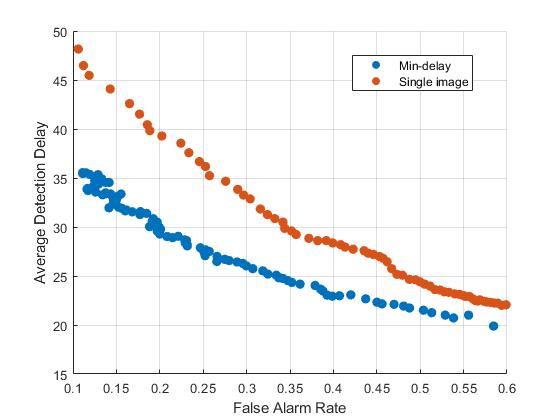

# Minimum Delay Object Detection From Video

A demo for the ICCV 2019 paper.

## A brief introduction

For almost every single computer vision task, if the result from a single frame is not reliable, we can always wait for another frame, get another result, combine the results from both frames, and hopefully, and for most of the time, get better accuracy / reliability. Simple logic. However, waiting for another frame ==> longer delay. For example, long delay can never be tolerated by self-driving vehicles. We do not want to be killed just because the obstacle detection algorithm is 'waiting for another frame'. On the other hand, the vehicle can achieve absolute zero delay by outputing some nonsense and decalre a obstacle in every single frame. Then the vehicle will never be able to move...

Is there any method that can balance the delay and accuracy? Well, you can read [our paper](https://arxiv.org/abs/1908.11092)... If you find the paper hard to follow, you may look at the [QUICKEST CHANGE DETECTION theory](https://arxiv.org/abs/1210.5552) first. The theory and the algorithm provides asymptotically optimal delay given a certain tolerated accuracy level. Based on the theory, we made some modeling, modifications and simplifications, and somehow made it work in the object detection task. If you are interested in moving object detection and segmentation, you may also check our other paper out: [Minimum Delay Moving Object Detection](http://openaccess.thecvf.com/content_cvpr_2017/papers/Lao_Minimum_Delay_Moving_CVPR_2017_paper.pdf)...

## Play with the demo

### Setting up the demo
Well, the proposed framework should work with any object detector that operates on single frames (and I am too lazy to write my own detector). I just grabbed [MMdetection](https://github.com/open-mmlab/mmdetection) in our experiments since it is simple to use. Shout out to the authors!

After installing MMdetection, you can play with this demo. I used the Faster R-CNN with ResNet 101 in this demo. You may download the model [here](https://s3.ap-northeast-2.amazonaws.com/open-mmlab/mmdetection/models/faster_rcnn_r101_fpn_1x_20181129-d1468807.pth). The model was trained on Coco, and seems that it works well on KITTI.

The experiments were done on [KITTI Tracking dataset](http://www.cvlibs.net/datasets/kitti/eval_tracking.php). 

Set up the dirs. Turn off nms and set how many bounding boxes you want to get in each frame. Run the detector. Do the CUSUM update. And hope everything works... Actually you can skip these steps by using the [configuration file](./ 	faster_rcnn_r101_fpn_1x.py) I uploaded and run the [detection.py](./detection.py) directly. All the experiments in the paper were done in Matlab. But I decided to move it to Python so we can skip some painful data saving & loading. Hopefully it works out!  

### Evaluation
After running the [detection.py](./detection.py) the results should be saved automatically. To evaluate the result, simply run the [evaluation.m](./evaluation.m). You might need to compile the [mex file for nms](./Evaluation_toolbox/nms_mex.cpp). What I got was this curve:



### Something really need to be taken care off
In the paper we assume the detectors output some sort of probability (the details are in the paper), and the derivation is based on that. However, different detectors behave totally differently. Some are smoother while others may output some extreme results (like either 0 or 0.99... If you are working on detectors you must know what I am saying!). So you may want to (or you have to) tune the priors carefully. After that, remember to choose the right range of the threshold in the evaluaton code to make the scatter plot look nice. I have put some comments in the code.

### Some extra comments
Remember that the result you get from the code is NOT the final result for the video. Let me explain why:

In practice, if you want to implement the minimum delay framework, the logic should be:
Get the raw detection result ==> compute the CUSUM statistic according to our paper ==》thresholding ==> declare a detection. Once a detection is declared, you may do tracking or whatever you want according to your specific task. 

However, every single time we change the threshold, we will need to go through this pipeline again. It will take decades to make the scatter plots above. So instead, we just let the CUSUM statistic accumulate and never stop it. During evaluation, each time we threshold it, we will get a collection of FIRST DECLARED DETECTIONS. Then we can make the plot. So remember, these are not the final results as we do not take care of tracking or whatever after any detection is declared.

### Cite me!

If you are working on single frame object detectors, and want to play with this minimum delay framework, go ahead! My intuition is that if the detector behaves smoother, more consistant and robust, the min-delay framework should work better (not confirmed yet... If you have any interesting result please let me know!). 

Or you can simply test your single frame algorithm under the minimum delay setting using our evaluation code! You get an extra experiment in the paper and I get an extra citation! Win-Win!

To cite our paper, 

```
@article{min_delay,
  title   = {Minimum Delay Object Detection From Video},
  author  = {Lao, Dong and Sundaramoorthi, Ganesh},
  journal= {arXiv preprint arXiv:1908.11092},
  year={2019}
}
```

## Have fun!


